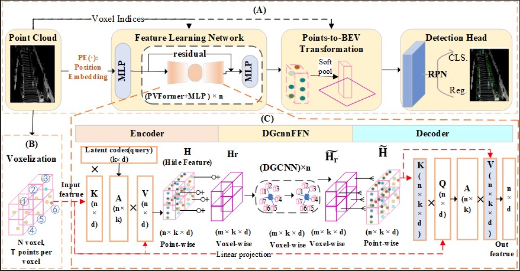

## Introduction


### Highlights：
- （1）Hybrid Architecture
PVT-DGCNN unifies PVFormer (local voxel attention) and DGcnnFFN (global graph convolution) for joint local-global feature learning, tackling fixed-receptive-field limitations.
- （2）Dynamic Scaling
Adapts to object sizes by tuning K-values in graph construction: large K for sparse areas (context expansion), small K for dense zones (local focus), e.g., K=7 for pedestrians vs. K=3 for cars.
- （3）Small-Object Breakthrough
Achieves SOTA on small objects: +4.70 pedestrian AP (KITTI Easy), 75.87% L1-AP (Waymo), via interference-resistant local-global feature fusion.

### 1. Recommended Environment
- OpenPCDet Version: 0.5.2
- Linux (tested on Ubuntu 22.04)
- Python 3.7
- PyTorch 1.9 or higher (tested on PyTorch 1.13.0)
- CUDA 9.0 or higher (tested on CUDA 11.7)


### 2. Set the Environment

```shell
pip install -r requirements.txt
python setup.py build_ext --inplace 
```


### 3. Data Preparation

- Prepare [KITTI](http://www.cvlibs.net/datasets/kitti/eval_object.php?obj_benchmark=3d) dataset and [road planes](https://drive.google.com/file/d/1d5mq0RXRnvHPVeKx6Q612z0YRO1t2wAp/view?usp=sharing)

```shell
# Download KITTI and organize it into the following form:
├── data
│   ├── kitti
│   │   │── ImageSets
│   │   │── training
│   │   │   ├──calib & velodyne & label_2 & image_2 & (optional: planes)
│   │   │── testing
│   │   │   ├──calib & velodyne & image_2

# Generatedata infos:
python -m pcdet.datasets.kitti.kitti_dataset create_kitti_infos tools/cfgs/dataset_configs/kitti_dataset.yaml
```

### 4. Pretrain model

PLEASE NOTE: For the voxel-based methods, the point clouds are randomly sampled, which results in some deviation in the prediction outcomes for each instance. However, the deviation is not expected to be too large. This is a normal phenomenon.


The performance (Best combination，using 11 recall poisitions) on KITTI validation set is as follows(single-stage):
```
		
Car  AP@0.70, 0.70, 0.70:

3d   AP: 89.00 78.63 77.34

Pedestrian AP@0.50, 0.50, 0.50:

3d   AP: 66.19 59.24 54.37

Cyclist AP@0.50, 0.50, 0.50:

3d   AP: 86.58 69.75 65.92
```

The performance (Best combination，using 40 recall poisitions) on the KITTI test set (two-stage).
In two-stage models are not suitable to directly report results on KITTI test set, please use slightly lower score threshold and train the models on all or 90% training data to achieve a desirable performance on KITTI test set.
```
Car  AP@0.70, 0.70, 0.70:

3D   AP: 90.43 81.61 76.97	
	
Pedestrian AP@0.50, 0.50, 0.50:

3D   AP: 51.94 44.92 41.73

Cyclist AP@0.50, 0.50, 0.50:

3D   AP: 82.57 68.58 61.69
```
Due to the voxel based method, each sampling point is random, so the results may vary during each training or testing.

### 5. Train

- Train with a single GPU

```shell

cd VoxT-DGCNN/tools
python train.py --cfg_file cfgs/kitti_models/pvt_dgcnn.yaml


```

### 6. Test with a pretrained model

```shell
cd VoxT-DGCNN/tools
python test.py --cfg_file --cfg_file ./cfgs/kitti_models/pvt_dgcnn.yaml --ckpt ${CKPT_FILE}
```
### 7. others
- To address the ultra-scale characteristics of Waymo1.2.0(https://waymo.com/open/) - whose data volume exceeds KITTI by over 20× with per-frame point cloud spatial coverage approximately 6× larger - we implemented optimized trade-offs in experimental design under computational resource constraints. Specifically, we strictly adhered to OpenPCDet(https://github.com/open-mmlab/OpenPCDet) framework conventions by utilizing approximately 20% of all training samples. For performance evaluation, comprehensive testing on the official WOD validation set was conducted, with rigorous computation of both AP and APH following the dual-difficulty-level (L1/L2) evaluation protocol, ensuring the authority and comparability of experimental results.
- "tools\cfgs\waymo_models\pvt_sgcnn.yaml", "pvt_sgcnn_two_stage_car&cyclist.yaml", and "pvt_ecovgnn_two_stage_pedestrian.yaml" uses static graph convolution (with less latency) for training

### 8. Acknowledgement
- This project is built on [OpenPCDet](https://github.com/open-mmlab/OpenPCDet). 
- Some codes are from [PyG](https://pytorch-geometric.readthedocs.io/en/latest/generated/torch_geometric.nn.conv.DynamicEdgeConv.html#torch_geometric.nn.conv.DynamicEdgeConv) and [Voxel Set Transformer](https://github.com/skyhehe123/VoxSeT).


